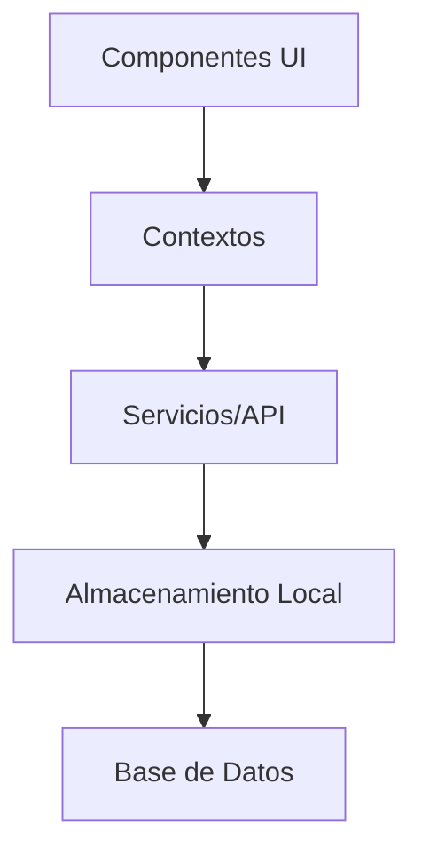

<div align="center">
  
  <h1>Wheek - Gestión Empresarial Inteligente</h1>
  <p>Plataforma todo en uno para la administración integral de tu negocio</p>
  
  []()
  [](LICENSE)
  []()
</div>

## Características Principales

- **Gestión de Inventario** - Control de stock en tiempo real con alertas de bajo inventario
- **Ventas y Facturación** - Procesamiento rápido de ventas con generación de facturas electrónicas
- **Clientes y CRM** - Base de datos de clientes con historial de compras y preferencias
- **Reportes Avanzados** - Análisis detallados de ventas, inventario y rendimiento
- **Multi-sucursal** - Gestión centralizada de múltiples ubicaciones
- **Soporte Offline** - Funcionalidad disponible sin conexión a internet (soon)

## Capturas de Pantalla

Pronto serán añadidas

## Tecnologías Utilizadas

- **Frontend**: React Native, Expo, TypeScript
- **Navegación**: React Navigation
- **Estado**: React Context API
- **UI/UX**: Componentes personalizados y diseño responsivo
- **Persistencia**: AsyncStorage para datos locales

## Instalación

1. Clona el repositorio:
   ```bash
   git clone https://github.com/anthonycursewl/wheek-app-rn.git
   cd wheek-app-rn
   ```

2. Instala las dependencias:
   ```bash
   npm install
   # o
   yarn install
   ```

3. Inicia la aplicación:
   ```bash
   npx expo start
   ```

4. Escanea el código QR con la aplicación Expo Go (iOS/Android) o usa un emulador.

## Estructura del Proyecto

```
wheek-app-rn/
├── app/                    # Rutas y pantallas principales
├── assets/                 # Recursos estáticos (imágenes, fuentes, etc.)
├── components/            # Componentes reutilizables
│   └── BottomTabs/        # Navegación inferior
├── context/               # Contextos de React
├── hooks/                 # Custom Hooks
├── styles/                # Estilos globales
└── utils/                 # Utilidades y helpers
```

## Arquitectura



## Cómo Contribuir

1. Haz un Fork del proyecto
2. Crea una rama para tu feature (`git checkout -b feature/AmazingFeature`)
3. Haz commit de tus cambios (`git commit -m 'Add some AmazingFeature'`)
4. Haz push a la rama (`git push origin feature/AmazingFeature`)
5. Abre un Pull Request

## Licencia

Distribuido bajo la licencia MIT. Ver `LICENSE` para más información.

## Desarrollado por

**Anthony Cursewl**

- [GitHub](https://github.com/anthonycursewl)
- [LinkedIn](https://www.linkedin.com/in/anthonycursewl/)
- [Twitter](https://x.com/anthonycursewl)

---

<div align="center">
  <sub>Hecho con ❤️ por Anthony Cursewl</sub>
</div>