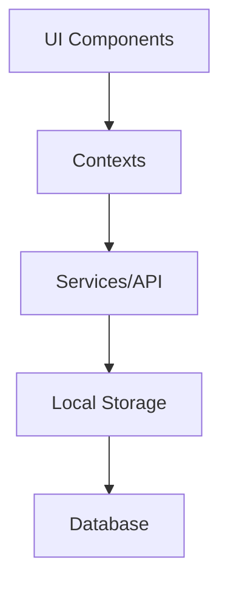

<div align="center">
  
  <h1>Wheek - Intelligent Business Management</h1>
  <p>All-in-one platform for comprehensive business administration</p>
  
  []()
  [](LICENSE)
  []()
</div>

## Main Features

- **Inventory Management** - Real-time stock control with low inventory alerts
- **Sales and Invoicing** - Fast sales processing with electronic invoice generation
- **Clients and CRM** - Customer database with purchase history and preferences
- **Advanced Reports** - Detailed analysis of sales, inventory, and performance
- **Multi-branch** - Centralized management of multiple locations
- **Offline Support** - Functionality available without internet connection (soon)

## Screenshots

Coming soon

## Technologies Used

- **Frontend**: React Native, Expo, TypeScript
- **Navigation**: React Navigation
- **State Management**: React Context API
- **UI/UX**: Custom components and responsive design
- **Persistence**: AsyncStorage for local data

## Installation

1. Clone the repository:
   ```bash
   git clone https://github.com/anthonycursewl/wheek-app-rn.git
   cd wheek-app-rn
   ```

2. Install dependencies:
   ```bash
   npm install
   # or
   yarn install
   ```

3. Start the application:
   ```bash
   npx expo start
   ```

4. Scan the QR code with the Expo Go app (iOS/Android) or use an emulator.

## Project Structure

```
wheek-app-rn/
├── app/                    # Main routes and screens
├── assets/                 # Static resources (images, fonts, etc.)
├── components/            # Reusable components
│   └── BottomTabs/        # Bottom navigation
├── context/               # React Contexts
├── hooks/                 # Custom Hooks
├── styles/                # Global styles
└── utils/                 # Utilities and helpers
```

## Architecture



## How to Contribute

1. Fork the project
2. Create your Feature Branch (`git checkout -b feature/AmazingFeature`)
3. Commit your Changes (`git commit -m 'Add some AmazingFeature'`)
4. Push to the Branch (`git push origin feature/AmazingFeature`)
5. Open a Pull Request

## License

Distributed under the MIT License. See `LICENSE` for more information.

## Developed by

**Anthony Cursewl**

- [GitHub](https://github.com/anthonycursewl)
- [LinkedIn](https://www.linkedin.com/in/anthonycursewl/)
- [Twitter](https://x.com/anthonycursewl)

---

<div align="center">
  <sub>Made with ❤️ by Anthony Cursewl</sub>
</div>