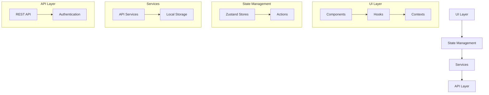

<div align="center">
  
  <h1>Wheek - Intelligent Business Management</h1>
  <p>All-in-one platform for comprehensive business administration</p>
  
  []()
  [](LICENSE)
  []()
  [](https://www.typescriptlang.org/)
  [](https://reactnative.dev/)
  [](https://expo.dev/)
</div>

## Main Features

- **Inventory Management** - Real-time stock control with low inventory alerts and barcode scanning
- **Sales and Invoicing** - Fast sales processing with electronic invoice generation
- **Clients and CRM** - Customer database with purchase history and preferences
- **Advanced Reports** - Detailed analysis of sales, inventory, and performance metrics
- **Multi-branch** - Centralized management of multiple business locations
- **Cross-platform** - Works on iOS, Android, and Web with a single codebase
- **Barcode Scanner** - Built-in barcode scanning for quick product lookups

## Screenshots

Coming soon (when I wrote soon, it wasn't that soon, sorry!)

## Technologies Used

- **Frontend Framework**: React Native 0.79.5 with TypeScript
- **Development Platform**: Expo 53
- **State Management**: Zustand 5.0.5
- **Navigation**: React Navigation 7.x with Expo Router
- **UI Components**: 
  - React Native Paper 5.14.5
  - React Native SVG 15.11.2
  - Expo Vector Icons 14.1.0
- **Form Handling**: Built-in form state management
- **Storage**: AsyncStorage for local data persistence
- **API Client**: Custom HTTP client with secure fetch implementation

## Getting Started

### Prerequisites

- Node.js 16+ and npm/yarn
- Expo CLI (`npm install -g expo-cli`)
- iOS Simulator (for iOS development) or Android Studio (for Android development)
- For physical device testing: Expo Go app (iOS/Android)

### Installation

1. Clone the repository:
   ```bash
   git clone https://github.com/anthonycursewl/wheek-app-rn.git
   cd wheek-app-rn
   ```

2. Install dependencies:
   ```bash
   npm install
   # or
   yarn install
   ```

3. Configure environment variables:
   Create a `.env` file in the root directory with the following variables:
   ```
   API_BASE_URL=your_api_url_here
   # Add other environment variables as needed
   ```

4. Start the development server:
   ```bash
   npx expo start
   ```

5. Run on specific platform:
   ```bash
   # For iOS
   npm run ios
   
   # For Android
   npm run android
   
   # For Web
   npm run web
   ```

## Project Structure

```
wheek-app-rn/
├── app/                    # App routes using Expo Router
│   ├── auth/              # Authentication flows
│   ├── categories/        # Category management
│   ├── dashboard/         # Main dashboard
│   └── products/          # Product management
├── assets/                # Static resources (images, fonts, sounds)
│   ├── fonts/             # Custom fonts
│   └── images/            # Image assets
├── components/            # Reusable UI components
│   ├── BottomTabs/        # Bottom tab navigation
│   ├── Buttons/           # Button components
│   ├── CustomText/        # Custom text components
│   └── Input/             # Form input components
├── config/                # App configuration
├── constants/             # Constants and enums
│   └── ui/                # UI-related constants (colors, spacing, etc.)
├── contexts/              # React Context providers
├── flux/                  # State management
│   ├── Actions/           # Action creators
│   ├── entities/          # TypeScript interfaces
│   ├── services/          # API service layer
│   └── stores/            # Zustand stores
├── hooks/                 # Custom React hooks
│   └── http/              # HTTP request hooks
├── shared/                # Shared utilities and components
│   ├── components/        # Shared UI components
│   ├── constants/         # Shared constants
│   ├── interfaces/        # Shared TypeScript interfaces
│   └── services/          # Shared services
└── svgs/                  # SVG icon components
```

## Architecture

The application follows a clean architecture pattern with clear separation of concerns:



## Development

### Available Scripts

- `npm start` - Start the development server
- `npm run android` - Run on Android device/emulator
- `npm run ios` - Run on iOS simulator
- `npm run web` - Run on web browser
- `npm run lint` - Run ESLint
- `npm run reset-project` - Reset the project state

### Code Style

- Follow the [React Native Style Guide](https://github.com/airbnb/javascript/tree/master/react)
- Use TypeScript for all new components and modules
- Prefer functional components with hooks
- Use absolute imports with path aliases (configured in `babel.config.js`)
- Follow the existing file and folder naming conventions

### State Management

The app uses Zustand for state management with the following patterns:
- Stores are located in `flux/stores/`
- Actions are defined in `flux/Actions/`
- Services for API calls are in `flux/services/`

## Contributing

We welcome contributions! Here's how you can help:

1. Fork the repository
2. Create a feature branch (`git checkout -b feature/amazing-feature`)
3. Commit your changes (`git commit -m 'Add some amazing feature'`)
4. Push to the branch (`git push origin feature/amazing-feature`)
5. Open a Pull Request

### Reporting Issues

When reporting issues, please include:
- Steps to reproduce the issue
- Expected vs actual behavior
- Device/OS version
- Any relevant error messages

## License

This project is licensed under the MIT License - see the [LICENSE](LICENSE) file for details.

## Developed by

**Anthony Cursewl**

- [GitHub](https://github.com/anthonycursewl)
- [LinkedIn](https://www.linkedin.com/in/anthonycursewl/)
- [Twitter](https://x.com/anthonycursewl)

---

<div align="center">
  <sub>Built with ❤️ and TypeScript by Anthony Cursewl</sub>
</div>